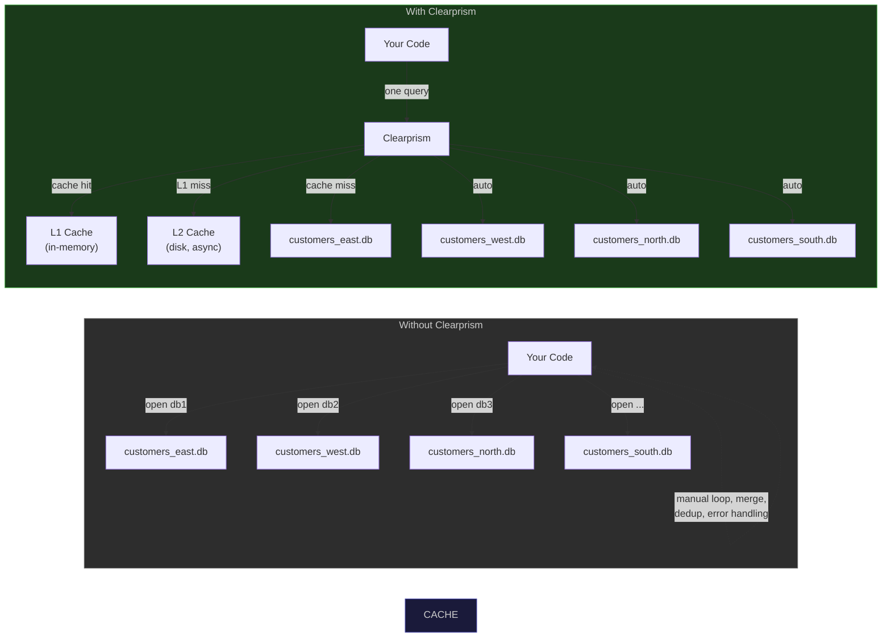
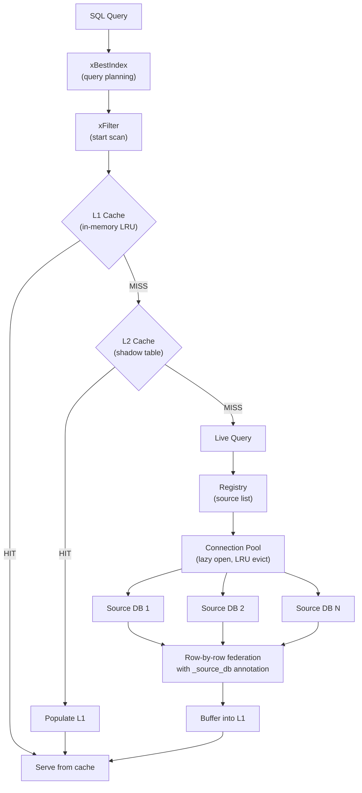

# Clearprism

A SQLite extension that federates read-only queries across multiple SQLite databases sharing the same schema. Query 100+ databases as if they were a single table.



### Why Clearprism?

Benchmarked against manually querying 100 SQLite databases (100M rows total):

| Scenario | Do It Yourself | Clearprism (SQL) | Speedup |
|----------|----------------|------------------|---------|
| Point lookup across 100 DBs | 2.21ms | **59us** | **37x faster** |
| Filtered scan (~1% selectivity) | 50.4s | **553ms** | **91x faster** |
| Full scan (100M rows, first query) | 59.4s | 145s | see below |
| Full scan (100M rows, cached) | 59.4s | **553ms** | **107x faster** |

The first full scan of 100M rows through SQL is slower than direct SQLite (145s vs 59s). This is inherent to SQLite's [virtual table protocol](https://www.sqlite.org/vtab.html) — each row requires ~10 indirect function calls (xEof, xNext, xColumn per column, xRowid) that add up across 100M rows. This overhead only matters for uncached full scans of very large datasets. For filtered queries, point lookups, and any repeated query, the L1/L2 cache eliminates source I/O entirely.

For C applications that need raw full-scan throughput (ETL, bulk export, analytics), the [Scanner API](#streaming-scanner-api) bypasses the virtual table protocol:

| Scenario | Direct SQLite | Scanner API |
|----------|---------------|-------------|
| Full scan, sequential | 59.4s (1.68M rows/s) | 50.5s (1.98M rows/s) |
| Full scan, 16 threads | 23.1s (4.33M rows/s) | **18.5s (5.39M rows/s)** |

```sql
-- Load the extension
.load ./clearprism

-- Create a federated view across all source databases
CREATE VIRTUAL TABLE all_users USING clearprism(
    registry_db='/path/to/registry.db',
    table='users'
);

-- Query all databases at once
SELECT name, email, _source_db FROM all_users WHERE email LIKE '%@example.com';

-- Query a specific source database
SELECT * FROM all_users WHERE _source_db = 'west_region';
```

Caching is automatic — an L2 disk cache populates in the background as soon as the table is created. The first query reads from sources directly; subsequent queries serve from cache with no source I/O. For datasets that never change, use **snapshot mode** to materialize all data at creation time:

```sql
-- Default: L2 cache auto-populates in the background
CREATE VIRTUAL TABLE all_users USING clearprism(
    registry_db='/path/to/registry.db',
    table='users'
);

-- Snapshot mode: materialize everything at creation, no background refresh
CREATE VIRTUAL TABLE all_users USING clearprism(
    registry_db='/path/to/registry.db',
    table='users',
    mode='snapshot'
);
```

## Features

- **Federated queries** across 100+ SQLite databases with identical schemas
- **Hidden `_source_db` column** on every row identifying which database it came from
- **Hidden `_source_errors` column** reports how many sources failed during a query
- **WHERE pushdown** sends constraints (EQ, GT, GE, LT, LE, LIKE, NE, GLOB, IS NULL, IS NOT NULL, REGEXP, MATCH, IN) to each source database
- **LIMIT/OFFSET pushdown** stops scanning after the requested rows, skips offset rows
- **ORDER BY pushdown** for single-source queries (when `_source_db` is constrained)
- **Stable composite rowids** encoding `(source_id << 40) | source_rowid` for efficient `WHERE rowid = ?` lookups
- **IN pushdown** expands `WHERE col IN (...)` into parameterized queries on each source (SQLite 3.38.0+)
- **REGEXP/MATCH fallback** pushes these operators to sources that support them, falls back to SQLite post-filtering otherwise
- **Two-tier caching** with in-memory LRU (L1) and disk-based shadow tables (L2, async background populate)
- **Connection pooling** with lazy opening and LRU eviction
- **Parallel scanner** with zero-copy push-based callbacks for maximum throughput (5.4M rows/sec)
- **Registry auto-reload** detects source list changes without restarting
- **Resilient** — skips unavailable sources instead of failing the entire query
- **Thread-safe** with per-component locking and a strict lock hierarchy
- **Snapshot mode** materializes all source data into a local shadow table for fast repeated queries
- **Schema override** bypasses auto-discovery with a user-supplied column definition
- **Admin SQL functions** for runtime diagnostics, cache management, and registry setup
- **Strict parameter validation** with clear error messages for invalid configuration

## Quick Start

### Prerequisites

- C11 compiler (gcc or clang)
- SQLite 3.10.0+ with development headers (`libsqlite3-dev`)
- pthreads

### Build

```bash
# Using Make
make

# Or using CMake
mkdir build && cd build
cmake ..
make
```

This produces `clearprism.so` (Linux) or `clearprism.dylib` (macOS).

### Setup

**1. Create a registry database** listing your source databases:

```sql
-- Option A: Use the built-in helper
.load ./clearprism
SELECT clearprism_init_registry('/path/to/registry.db');
SELECT clearprism_add_source('unified_users', '/data/east.db', 'east');
SELECT clearprism_add_source('unified_users', '/data/west.db', 'west');
SELECT clearprism_add_source('unified_users', '/data/north.db', 'north');
```

```sql
-- Option B: Create manually
sqlite3 registry.db <<'SQL'
CREATE TABLE clearprism_sources (
    id INTEGER PRIMARY KEY AUTOINCREMENT,
    path TEXT NOT NULL UNIQUE,
    alias TEXT NOT NULL UNIQUE,
    active INTEGER NOT NULL DEFAULT 1,
    priority INTEGER NOT NULL DEFAULT 0,
    added_at TEXT NOT NULL DEFAULT (datetime('now')),
    notes TEXT
);

INSERT INTO clearprism_sources (path, alias) VALUES ('/data/east.db', 'east');
INSERT INTO clearprism_sources (path, alias) VALUES ('/data/west.db', 'west');
INSERT INTO clearprism_sources (path, alias) VALUES ('/data/north.db', 'north');
SQL
```

**2. Load and use the extension:**

```sql
.load ./clearprism

CREATE VIRTUAL TABLE unified_users USING clearprism(
    registry_db='registry.db',
    table='users'
);

SELECT name, email, _source_db FROM unified_users;
```

## Configuration

All parameters are passed as `key=value` pairs in the `CREATE VIRTUAL TABLE` statement:

| Parameter | Required | Default | Description |
|-----------|----------|---------|-------------|
| `registry_db` | Yes | — | Path to the registry database |
| `table` | Yes | — | Name of the table to federate |
| `mode` | No | `live` | `live` (query on demand) or `snapshot` (materialize at creation) |
| `cache_db` | No | auto (`/tmp/...`) | Path for L2 disk cache; auto-generated if omitted, `'none'` to disable |
| `l1_max_rows` | No | `10000` | Maximum rows in L1 memory cache |
| `l1_max_bytes` | No | `67108864` | Maximum bytes in L1 cache (64 MiB) |
| `pool_max_open` | No | `32` | Maximum simultaneously open database connections |
| `l2_refresh_sec` | No | `300` | L2 shadow table refresh interval in seconds |
| `schema` | No | — | Manual column definition (e.g., `'id INTEGER, name TEXT'`), bypasses auto-discovery |

All integer parameters are validated at creation time — non-numeric values, negative numbers, and zero are rejected with a descriptive error. Unknown parameters are also rejected. `mode` only accepts `live` or `snapshot`.

## Architecture Overview



## Documentation

- [Architecture](docs/architecture.md) — System design, data structures, and query flow
- [Configuration](docs/configuration.md) — All parameters and tuning guidance
- [Registry](docs/registry.md) — Registry database schema and management
- [Caching](docs/caching.md) — Two-tier cache design (L1 + L2)
- [API Reference](docs/api.md) — Public C API
- [Building](docs/building.md) — Build instructions and dependencies
- [Testing](docs/testing.md) — Test suite and how to run it

## Project Structure

```
clearprism/
├── include/
│   └── clearprism.h            # Public API header (all types and function declarations)
├── src/
│   ├── clearprism_main.c       # Extension entry point, module registration
│   ├── clearprism_vtab.c       # Virtual table lifecycle (create, connect, open, close)
│   ├── clearprism_query.c      # Query execution (xBestIndex, xFilter, xNext, xColumn)
│   ├── clearprism_registry.c   # Registry database reading and source enumeration
│   ├── clearprism_connpool.c   # Connection pool with lazy open and LRU eviction
│   ├── clearprism_cache.c      # Unified cache facade (L1 → L2 → live)
│   ├── clearprism_cache_l1.c   # In-memory LRU cache
│   ├── clearprism_cache_l2.c   # Shadow table cache with background refresh
│   ├── clearprism_where.c      # WHERE constraint encoding and SQL generation
│   ├── clearprism_util.c       # Helpers (FNV-1a hash, string utils, error formatting)
│   ├── clearprism_scanner.c    # Streaming scanner API (zero-vtab-overhead iteration)
│   ├── clearprism_agg.c        # Aggregate pushdown functions (COUNT, SUM, MIN, MAX, AVG)
│   └── clearprism_admin.c      # Admin/diagnostic SQL functions
├── test/
│   ├── test_main.c             # Test runner
│   ├── test_registry.c         # Registry unit tests
│   ├── test_connpool.c         # Connection pool unit tests
│   ├── test_cache.c            # L1 and unified cache tests
│   ├── test_vtab.c             # End-to-end virtual table tests
│   ├── test_agg.c              # Aggregate pushdown tests
│   ├── test_scanner.c          # Scanner API tests
│   └── test_admin.c            # Admin function and UX tests
├── CMakeLists.txt
└── Makefile
```

## Streaming Scanner API

For C applications doing bulk reads (ETL, analytics, exports) over very large datasets, the Scanner API bypasses the virtual table protocol entirely. It calls `sqlite3_step()` and `sqlite3_column_*()` directly — no per-row function dispatch overhead. Sequential mode matches direct SQLite speed; parallel mode with work-stealing across threads exceeds it.

```c
clearprism_scanner *sc = clearprism_scan_open("registry.db", "users");

clearprism_scan_filter(sc, "email LIKE ?");
clearprism_scan_bind_text(sc, 1, "%@example.com");

while (clearprism_scan_next(sc)) {
    const char *name  = clearprism_scan_text(sc, 1);   // zero-copy
    const char *email = clearprism_scan_text(sc, 2);
    printf("%s: %s (from %s)\n", name, email, clearprism_scan_source_alias(sc));
}

clearprism_scan_close(sc);
```

For even higher throughput, use the parallel scanner to distribute sources across worker threads with zero-copy callbacks:

```c
int my_callback(sqlite3_stmt *stmt, int n_cols, const char *source_alias,
                int thread_id, void *ctx) {
    int64_t *counts = (int64_t *)ctx;
    counts[thread_id]++;
    return 0;  // 0 = continue, non-zero = stop
}

clearprism_scanner *sc = clearprism_scan_open("registry.db", "users");
int64_t counts[16] = {0};
clearprism_scan_parallel(sc, 16, my_callback, counts);
clearprism_scan_close(sc);
```

See the [API Reference](docs/api.md) for full scanner documentation.

## Admin & Diagnostic Functions

Clearprism registers SQL functions for runtime introspection and management:

```sql
-- View live stats (L1 cache, pool, registry, warnings)
SELECT clearprism_status('my_vtab');

-- Initialize a new registry database with the correct schema
SELECT clearprism_init_registry('/path/to/registry.db');

-- Add a source to an existing vtab's registry
SELECT clearprism_add_source('my_vtab', '/data/new.db', 'new_region');

-- Flush the L1 cache for a vtab
SELECT clearprism_flush_cache('my_vtab');

-- Force-reload the registry (pick up source changes immediately)
SELECT clearprism_reload_registry('my_vtab');
```

`clearprism_status` returns a JSON object with L1 cache stats (entries, rows, bytes, hits, misses), connection pool stats (open, max, checked_out), registry info (source count, last reload), L2 status, and any initialization warnings.

See the [API Reference](docs/api.md#admin-functions) for full documentation.

## License

MIT
