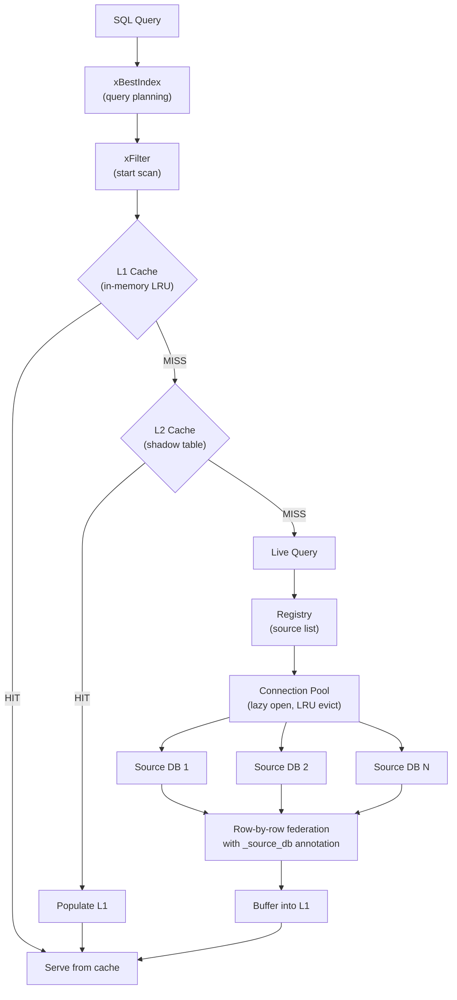

# Clearprism

A SQLite virtual table extension that federates read-only queries across multiple SQLite databases sharing the same schema. Query 100+ databases as if they were a single table.

```sql
-- Load the extension
.load ./clearprism

-- Create a federated view of the "users" table across all source databases
CREATE VIRTUAL TABLE all_users USING clearprism(
    registry_db='/path/to/registry.db',
    table='users'
);

-- Query all databases at once
SELECT name, email, _source_db FROM all_users WHERE email LIKE '%@example.com';

-- Query a specific source database
SELECT * FROM all_users WHERE _source_db = 'west_region';
```

## Features

- **Federated queries** across 100+ SQLite databases with identical schemas
- **Hidden `_source_db` column** on every row identifying which database it came from
- **WHERE pushdown** sends constraints to each source database for efficient filtering
- **Two-tier caching** with in-memory LRU (L1) and disk-based shadow tables (L2)
- **Connection pooling** with lazy opening and LRU eviction
- **Resilient** — skips unavailable sources instead of failing the entire query
- **Thread-safe** with per-component locking and a strict lock hierarchy

## Quick Start

### Prerequisites

- C11 compiler (gcc or clang)
- SQLite 3.10.0+ with development headers (`libsqlite3-dev`)
- pthreads

### Build

```bash
# Using Make
make

# Or using CMake
mkdir build && cd build
cmake ..
make
```

This produces `clearprism.so` (Linux) or `clearprism.dylib` (macOS).

### Setup

**1. Create a registry database** listing your source databases:

```sql
sqlite3 registry.db <<'SQL'
CREATE TABLE clearprism_sources (
    id INTEGER PRIMARY KEY AUTOINCREMENT,
    path TEXT NOT NULL UNIQUE,
    alias TEXT NOT NULL UNIQUE,
    active INTEGER NOT NULL DEFAULT 1,
    priority INTEGER NOT NULL DEFAULT 0,
    added_at TEXT NOT NULL DEFAULT (datetime('now')),
    notes TEXT
);

INSERT INTO clearprism_sources (path, alias) VALUES ('/data/east.db', 'east');
INSERT INTO clearprism_sources (path, alias) VALUES ('/data/west.db', 'west');
INSERT INTO clearprism_sources (path, alias) VALUES ('/data/north.db', 'north');
SQL
```

**2. Load and use the extension:**

```sql
.load ./clearprism

CREATE VIRTUAL TABLE unified_users USING clearprism(
    registry_db='registry.db',
    table='users'
);

SELECT name, email, _source_db FROM unified_users;
```

## Configuration

All parameters are passed as `key=value` pairs in the `CREATE VIRTUAL TABLE` statement:

| Parameter | Required | Default | Description |
|-----------|----------|---------|-------------|
| `registry_db` | Yes | — | Path to the registry database |
| `table` | Yes | — | Name of the table to federate |
| `cache_db` | No | — | Path for L2 disk cache (enables shadow tables) |
| `l1_max_rows` | No | `10000` | Maximum rows in L1 memory cache |
| `l1_max_bytes` | No | `67108864` | Maximum bytes in L1 cache (64 MiB) |
| `pool_max_open` | No | `32` | Maximum simultaneously open database connections |
| `l2_refresh_sec` | No | `300` | L2 shadow table refresh interval in seconds |

## Architecture Overview



## Documentation

- [Architecture](docs/architecture.md) — System design, data structures, and query flow
- [Configuration](docs/configuration.md) — All parameters and tuning guidance
- [Registry](docs/registry.md) — Registry database schema and management
- [Caching](docs/caching.md) — Two-tier cache design (L1 + L2)
- [API Reference](docs/api.md) — Public C API
- [Building](docs/building.md) — Build instructions and dependencies
- [Testing](docs/testing.md) — Test suite and how to run it

## Project Structure

```
clearprism/
├── include/
│   └── clearprism.h            # Public API header (all types and function declarations)
├── src/
│   ├── clearprism_main.c       # Extension entry point, module registration
│   ├── clearprism_vtab.c       # Virtual table lifecycle (create, connect, open, close)
│   ├── clearprism_query.c      # Query execution (xBestIndex, xFilter, xNext, xColumn)
│   ├── clearprism_registry.c   # Registry database reading and source enumeration
│   ├── clearprism_connpool.c   # Connection pool with lazy open and LRU eviction
│   ├── clearprism_cache.c      # Unified cache facade (L1 → L2 → live)
│   ├── clearprism_cache_l1.c   # In-memory LRU cache
│   ├── clearprism_cache_l2.c   # Shadow table cache with background refresh
│   ├── clearprism_where.c      # WHERE constraint encoding and SQL generation
│   └── clearprism_util.c       # Helpers (FNV-1a hash, string utils, error formatting)
├── test/
│   ├── test_main.c             # Test runner
│   ├── test_registry.c         # Registry unit tests
│   ├── test_connpool.c         # Connection pool unit tests
│   ├── test_cache.c            # L1 and unified cache tests
│   └── test_vtab.c             # End-to-end virtual table tests
├── CMakeLists.txt
└── Makefile
```

## License

MIT
