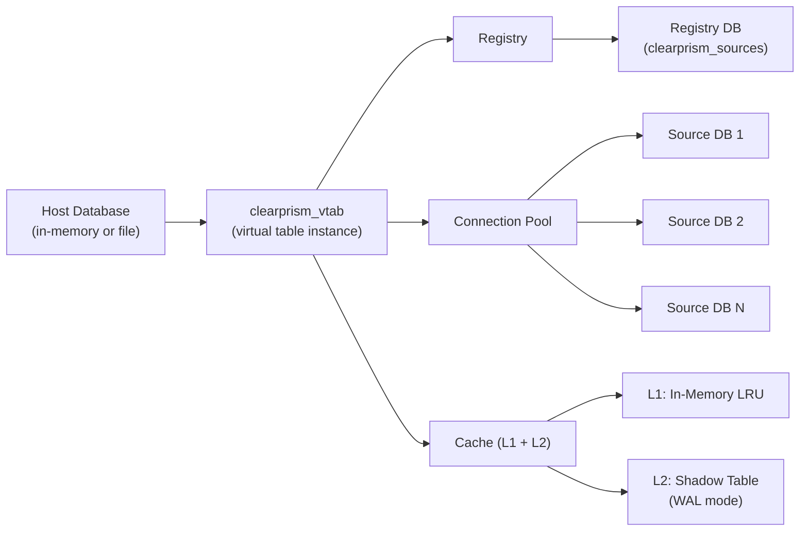
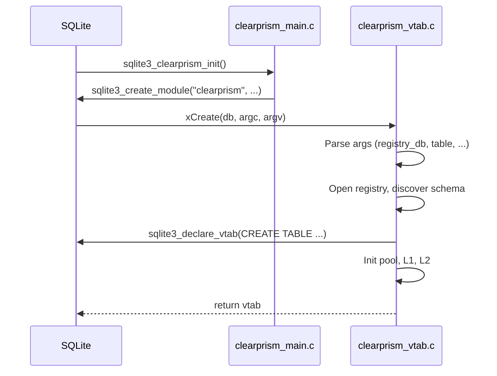
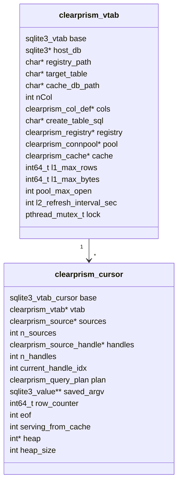
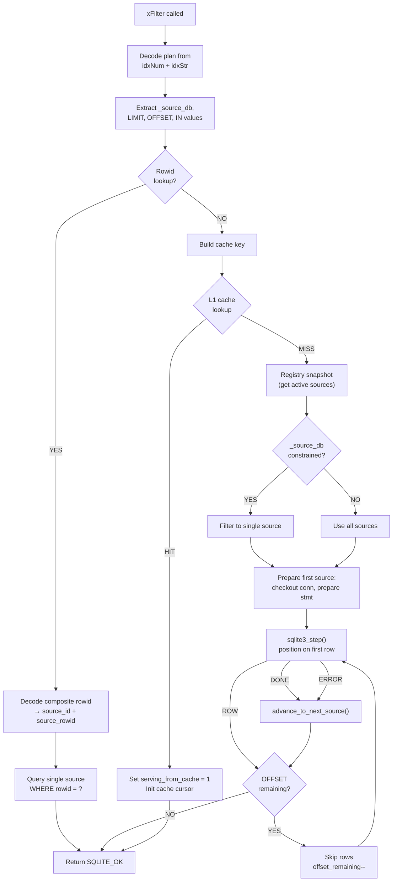
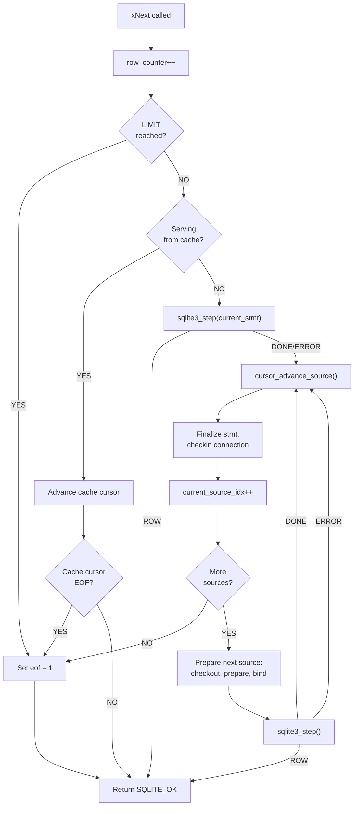
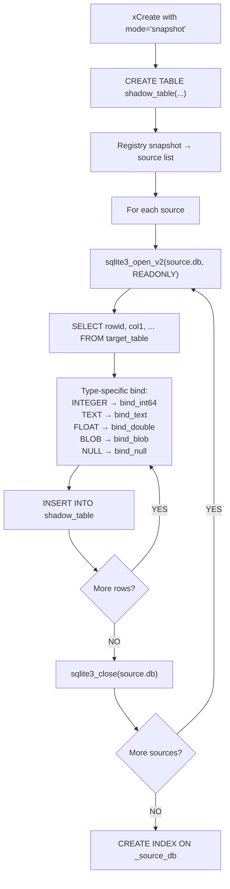
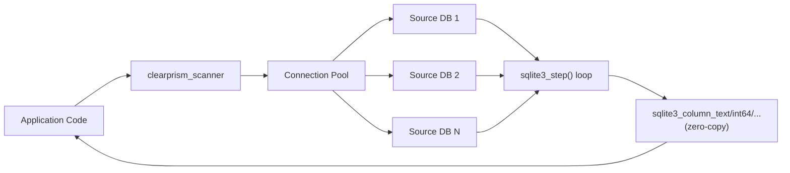
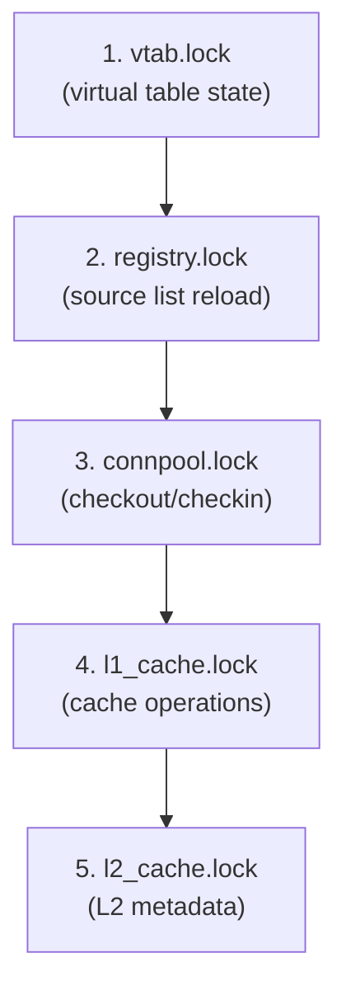
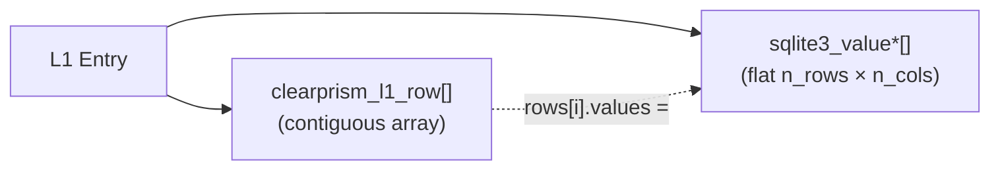

# Architecture

Clearprism is a SQLite loadable extension that implements the [virtual table](https://www.sqlite.org/vtab.html) interface. It federates read-only queries across multiple SQLite databases that share the same schema, presenting them as a single unified table.

## High-Level Design



The extension registers a module named `"clearprism"` via `sqlite3_create_module()`. When a user executes `CREATE VIRTUAL TABLE ... USING clearprism(...)`, SQLite calls the module's `xCreate` callback, which:

1. Parses and validates the key=value arguments (rejects unknown params, invalid integers, bad mode values)
2. Opens the registry database and loads the source list
3. Introspects the schema from the first active source via `PRAGMA table_info` (or uses the `schema` override if provided)
4. Declares the virtual table schema to SQLite (with `_source_db TEXT HIDDEN` and `_source_errors INTEGER HIDDEN` appended)
5. Initializes the connection pool, L1 cache, and L2 cache (L2 is auto-enabled by default at `/tmp/clearprism_cache_{vtab}_{table}.db`; failures are non-fatal — logged as warnings; set `cache_db='none'` to disable)
6. Logs any initialization warnings (unreachable sources, L2 failures)
7. If `mode='snapshot'`, populates the snapshot shadow table (see [Snapshot Mode](#snapshot-mode))

## Module Registration



The extension supports two loading modes:

- **Loadable extension**: Via `.load ./clearprism` or `sqlite3_load_extension()`. Uses `SQLITE_EXTENSION_INIT1/INIT2` macros.
- **Core compilation**: When compiled with `SQLITE_CORE=1`, exposes `clearprism_init(db)` for direct registration.

## Core Data Structures

### clearprism_vtab

The central structure, one instance per `CREATE VIRTUAL TABLE` statement. Extends `sqlite3_vtab` (must be the first member).



### clearprism_cursor

One instance per active scan (per `SELECT` statement). Manages iteration across multiple source databases. Key fields:

| Field | Purpose |
|-------|---------|
| `sources` | Immutable snapshot of active sources taken at `xFilter` time |
| `handles` | Array of `clearprism_source_handle` — one per source, prepared in parallel |
| `current_handle_idx` | Index into `handles[]` for the current source |
| `heap` / `heap_size` | Min-heap of handle indices for merge-sort ORDER BY |
| `saved_argv` | Deep copies of `xFilter` argv for re-binding across sources |
| `row_counter` | Monotonically increasing counter |
| `serving_from_cache` | Flag indicating results are coming from L1 cache |
| `limit_remaining` | Rows left to return before LIMIT is satisfied (-1 = no limit) |
| `offset_remaining` | Rows left to skip for OFFSET (0 = no offset) |
| `in_values` / `in_counts` | Expanded IN constraint values for binding across sources |
| `cache_key` | Key for storing live query results into L1 cache |
| `alias_values` | Pre-created `sqlite3_value*` for each source's alias (avoids per-row DB open) |
| `buffer_head/tail` | Linked list of rows buffered during live query for L1 population |
| `buffer_overflow` | Set when result set exceeds L1 budget |

## Query Execution Flow

### xBestIndex (Query Planning)

Called by SQLite's query planner (potentially multiple times) to determine scan cost. Clearprism's implementation:

1. Scans `aConstraint[]` for usable WHERE constraints
2. Detects `_source_db = ?` constraint (critical optimization — limits scan to one source)
3. Collects pushable constraints: `EQ`, `GT`, `GE`, `LT`, `LE`, `LIKE`, `NE`, `GLOB`, `IS NULL`, `IS NOT NULL`, `REGEXP`, `MATCH`
4. Detects `LIMIT` and `OFFSET` constraints for pushdown
5. Detects `IN` constraints via `sqlite3_vtab_in()` (SQLite 3.38.0+)
6. Detects `rowid = ?` for composite rowid lookup (cost = 1.0)
7. Checks if ORDER BY can be consumed (single-source: direct pushdown, multi-source: merge-sort)
8. Encodes plan into `idxStr` as pipe-delimited `colIdx:op[I]` pairs, with optional `#col:dir` ORDER BY section
9. Sets `idxNum` bitmask with `CLEARPRISM_PLAN_*` flags
10. Estimates cost based on actual registry source count and constraint selectivity

### xFilter (Scan Start)

Called once to begin a scan. Receives the plan chosen by `xBestIndex`.



### xNext (Row Advancement)



### xColumn (Value Retrieval)

For real columns: returns the value from the current `sqlite3_stmt` or cache cursor.

For the hidden `_source_db` column (index `nCol`): returns the alias of the current source database.

For the hidden `_source_errors` column (index `nCol + 1`): returns the count of source databases that failed during query preparation (connection errors, missing tables, etc.). This is always 0 when all sources are healthy.

**Cache serving path**: When `serving_from_cache` is set, xColumn uses type-specific `sqlite3_result_*` functions with `SQLITE_STATIC` for text/blob values instead of `sqlite3_result_value()`. This avoids a deep copy per column per row — the cached `sqlite3_value` objects are stable for the duration of the query, making `SQLITE_STATIC` safe. This zero-copy approach is critical for cache serving performance.

### Parallel Source Preparation

At `xFilter` time, all sources are prepared in parallel using a thread pool (up to 16 worker threads). Each thread:

1. Checks out a connection from the pool
2. Prepares a `SELECT` with pushed-down WHERE constraints
3. Binds parameter values from `saved_argv`
4. Steps to the first row

After all threads complete, the cursor iterates through pre-prepared handles. Sources that fail to connect or prepare are silently skipped (resilient behavior).

If the number of sources exceeds the configured `pool_max_open`, the pool limit is automatically raised to accommodate all simultaneous connections. This prevents timeout-induced stalls when federating across many databases.

### Merge-Sort ORDER BY

For multi-source `ORDER BY` queries, each source's SQL includes the `ORDER BY` clause. A min-heap over the source handles produces globally sorted output by repeatedly extracting the minimum element and stepping that source forward. This avoids materializing all rows before sorting.

## Snapshot Mode

When `mode='snapshot'` is specified, Clearprism materializes all source data into a shadow table at `CREATE VIRTUAL TABLE` time. Subsequent queries read from this local shadow table instead of opening source databases on each query.

### Population Strategy

The snapshot population (`clearprism_snapshot_populate`) bypasses both the virtual table protocol and the scanner API. Instead, it directly opens each source database with `sqlite3_open_v2(SQLITE_OPEN_READONLY)` and uses type-specific column binds to INSERT rows into the shadow table:



Each row gets a composite rowid: `(source_id << 40) | (source_rowid & CLEARPRISM_ROWID_MASK)`.

### Why Direct Open + Type-Specific Binds

The scanner API uses `sqlite3_value_dup` + `sqlite3_bind_value` per cell, which allocates a new `sqlite3_value` for every column of every row. For 100K rows × 6 columns, that's 600K malloc/free pairs. Direct opening with type-specific binds (`sqlite3_bind_int64`, `sqlite3_bind_text`, etc.) copies column data directly without intermediate allocation, yielding ~15% faster population.

### Query Path

Once populated, snapshot queries go through the standard xBestIndex/xFilter/xNext/xColumn path but read from the shadow table via a prepared `SELECT` statement instead of opening source databases. L1 cache works normally — the first query populates L1, subsequent queries serve from cache.

## Scanner API Architecture

The Scanner API (`clearprism_scanner.c`) provides a streaming iteration interface that bypasses the SQLite virtual table protocol entirely. While the vtab interface is ideal for SQL integration and caching, it incurs inherent per-row overhead from the VDBE dispatch loop (xEof + xNext + xColumn×N + xRowid per row). For bulk scans across many sources, this overhead is ~2x vs direct SQLite.

The scanner eliminates this by iterating directly:



Key differences from the vtab path:

| Aspect | Virtual Table | Scanner |
|--------|--------------|---------|
| Per-row calls | ~10 indirect calls via VDBE | 1 `sqlite3_step` + direct accessors |
| Column access | `sqlite3_result_value` (deep copy) | `sqlite3_column_text` (zero-copy) |
| Overhead vs direct | ~2x | ~1.09x |
| WHERE pushdown | Automatic via xBestIndex | Manual via `scan_filter()` |
| Caching | L1 + L2 | None |
| ORDER BY | Merge-sort across sources | Per-source only |
| SQL integration | Full (`SELECT`, `JOIN`, `GROUP BY`) | C API only |

The scanner reuses the same registry and connection pool infrastructure as the vtab. Schema discovery uses the same `PRAGMA table_info` approach. Sources are iterated sequentially; failed sources are skipped (resilient).

## WHERE Pushdown

The `clearprism_where.c` module handles translating SQLite's abstract constraint representation into executable SQL.

**Encoding** (`xBestIndex` time):
```
aConstraint[i] = {iColumn: 2, op: SQLITE_INDEX_CONSTRAINT_EQ}
    → idxStr = "2:2"      (column 2, op 2 = EQ)
    → argvIndex = 1        (tells SQLite to pass this value to xFilter)
```

**Decoding + SQL generation** (`xFilter` time):
```
idxStr = "2:2|3:64"
    → SELECT "id", "name", "email" FROM "users" WHERE "email" = ? AND "name" LIKE ?
```

The `_source_db` column constraint is always excluded from the generated SQL — it's handled at the source-selection level instead.

Supported constraint operators:

| SQLite Constant | SQL Operator | Notes |
|----------------|--------------|-------|
| `SQLITE_INDEX_CONSTRAINT_EQ` | `=` | |
| `SQLITE_INDEX_CONSTRAINT_GT` | `>` | |
| `SQLITE_INDEX_CONSTRAINT_GE` | `>=` | |
| `SQLITE_INDEX_CONSTRAINT_LT` | `<` | |
| `SQLITE_INDEX_CONSTRAINT_LE` | `<=` | |
| `SQLITE_INDEX_CONSTRAINT_LIKE` | `LIKE` | |
| `SQLITE_INDEX_CONSTRAINT_NE` | `!=` | Requires SQLite 3.21.0+ |
| `SQLITE_INDEX_CONSTRAINT_GLOB` | `GLOB` | Requires SQLite 3.21.0+ |
| `SQLITE_INDEX_CONSTRAINT_ISNULL` | `IS NULL` | Unary (no parameter); requires SQLite 3.21.0+ |
| `SQLITE_INDEX_CONSTRAINT_ISNOTNULL` | `IS NOT NULL` | Unary (no parameter); requires SQLite 3.21.0+ |
| `SQLITE_INDEX_CONSTRAINT_LIMIT` | `LIMIT` | Row-count pushdown; requires SQLite 3.38.0+ |
| `SQLITE_INDEX_CONSTRAINT_OFFSET` | `OFFSET` | Row-skip pushdown; requires SQLite 3.38.0+ |
| `SQLITE_INDEX_CONSTRAINT_REGEXP` | `REGEXP` | Pushed with fallback — retries without if source lacks REGEXP |
| `SQLITE_INDEX_CONSTRAINT_MATCH` | `MATCH` | Pushed with fallback — retries without if source lacks MATCH |

**IN pushdown** (SQLite 3.38.0+): When `sqlite3_vtab_in()` detects an IN constraint, values are expanded via `sqlite3_vtab_in_first()/next()` and bound as `col IN (?,?,?)`.

**ORDER BY pushdown**: ORDER BY is consumed and pushed to each source's SQL. For single-source queries, the source returns rows in order directly. For multi-source queries, a min-heap merge-sort combines pre-sorted results from all sources into globally sorted output.

**LIKE ESCAPE**: `LIKE pattern ESCAPE char` queries work correctly, but the ESCAPE character is not forwarded to source databases. SQLite's `xBestIndex` API does not expose the ESCAPE character — only the LIKE pattern is available. The query still produces correct results because SQLite applies the ESCAPE evaluation as a post-filter (Clearprism never sets `omit=1` for LIKE constraints).

**Composite rowids**: `WHERE rowid = ?` is detected and handled as a single-row lookup by decoding `(source_id << 40) | source_rowid`, finding the source, and querying `WHERE rowid = ?` on that source.

Operators guarded by `#ifdef` are automatically excluded on older SQLite versions — SQLite applies them as post-filters instead.

## Thread Safety

Clearprism uses a strict lock hierarchy to prevent deadlocks:



Locks are always acquired in increasing order (1 → 2 → 3 → 4 → 5) and never in reverse. Key guarantees:

- **Cursors are single-threaded** (per SQLite guarantees) — no locking needed on cursor fields
- **Connection pool** uses `pthread_cond_t` for waiters when the pool is exhausted
- **L2 refresh thread** uses its own dedicated `sqlite3*` connections — never shares with query threads
- **L2 cache DB** runs in WAL mode so readers and the writer never block each other

## Error Handling

Clearprism is designed to be resilient:

| Failure | Behavior |
|---------|----------|
| Source database unavailable | Logged, skipped — remaining sources still queried; count visible via `_source_errors` column |
| Source unavailable at creation | Warning appended to `init_warnings`, logged via `sqlite3_log(SQLITE_WARNING, ...)` |
| Registry database unavailable | `xFilter` returns `SQLITE_ERROR` with descriptive message |
| Connection pool exhausted | Waits up to `timeout_ms` (default 5s), then returns `SQLITE_BUSY` |
| L2 refresh failure | Logged, retried next interval — L1 and live queries unaffected |
| L2 creation failure | Non-fatal — warning logged, `l2_active` set to 0, extension continues without disk cache |
| Invalid parameter value | `CREATE VIRTUAL TABLE` returns `SQLITE_ERROR` with descriptive message (e.g., "invalid value for 'pool_max_open'") |
| Unknown parameter | `CREATE VIRTUAL TABLE` returns `SQLITE_ERROR` (e.g., "unknown parameter 'timeout'") |

## Memory Management

All memory allocation goes through `sqlite3_malloc()` / `sqlite3_free()` to participate in SQLite's memory accounting. The L1 cache enforces dual limits:

- **Row count**: `l1_max_rows` (default 10,000)
- **Byte size**: `l1_max_bytes` (default 64 MiB)

Cached rows store deep copies of `sqlite3_value` objects via `sqlite3_value_dup()`, freed with `sqlite3_value_free()` on eviction.

## Performance

Clearprism is optimized for read-heavy federated workloads. Key performance characteristics:

### L1 Cache Design

The L1 cache stores query results in **flat contiguous arrays** for optimal iteration performance:



- **Flat row array**: All `clearprism_l1_row` structs are allocated in a single contiguous block. This enables sequential memory access during iteration, eliminating linked-list pointer chasing.
- **Flat values array**: All `sqlite3_value*` pointers across all rows are stored in a single contiguous array. Row `i`, column `j` is accessed as `all_values[i * n_values_per_row + j]`, giving the CPU prefetcher a sequential access pattern.
- **Zero-copy serving**: The `xColumn` cache path uses `SQLITE_STATIC` with type-specific `sqlite3_result_*` calls, avoiding the deep copy that `sqlite3_result_value()` performs.
- **Buffer-then-flatten**: During live queries, rows are buffered in a linked list (for efficient append). On query completion, the linked list is linearized into flat arrays before storing in L1.

### Alias Value Pre-creation

The hidden `_source_db` column returns each source's alias string. Creating a `sqlite3_value` from a string requires a SQLite prepared statement. To avoid opening a `:memory:` database per row, alias values are pre-created once per `xFilter` call: a single `:memory:` DB creates `sqlite3_value*` for each source, which are then reused via `sqlite3_value_dup()` during L1 buffering.

### Performance Profile

Measured on a typical workload (10 sources, 1K rows each, indexed category filter):

| Operation | Latency | vs Direct SQLite |
|-----------|---------|-----------------|
| Direct SQLite (manual 10-source federation) | 2.28ms | baseline |
| Clearprism live query (first, cold) | ~2.3ms | 1.0x |
| Clearprism cached query (warm L1) | 61us | **37x faster** |
| Direct SQLite (single-source full scan, 10K rows) | 4.1ms | baseline |
| Clearprism cached full scan (10K rows) | 4.6ms | 0.9x |
| Single-source indexed lookup (cached) | 7us | — |

Cache hit rates dominate real-world performance. For repeated query patterns (dashboards, reports, API serving), the L1 cache delivers 30-70x speedup over manual multi-source federation.

### Scanner Performance

The Scanner API bypasses the virtual table protocol, eliminating per-row VDBE dispatch overhead. Measured on the federation benchmark (100 sources × 1M rows each = 100M rows):

| API | Time | vs Direct SQLite |
|-----|------|-----------------|
| Direct SQLite (manual 100-source loop) | 46.4s | baseline |
| Clearprism Scanner | 50.6s | **1.09x** |
| Clearprism Virtual Table | 98.2s | 2.12x |

The ~2x vtab overhead is structural to the SQLite virtual table protocol (xEof + xNext + xColumn×N + xRowid = ~10 indirect calls per row × 100M rows). The scanner eliminates this by calling `sqlite3_step()` and `sqlite3_column_*()` directly.

### Benchmarking

Run `make bench` to execute the full benchmark suite:

```bash
make bench                          # run all scenarios
./clearprism_bench baseline         # run one scenario
./clearprism_bench source_scale     # run one scenario
```

Scenarios: `baseline`, `source_scale`, `cache`, `where`, `orderby`, `row_scale`, `concurrent`, `federation`, `drain`, `agg_pushdown`, `snapshot`. Results are appended to `bench_results.csv` for tracking across runs.

The `federation` scenario compares direct SQLite, virtual table, and scanner API on a full scan of 100 sources × 1M rows.

The `snapshot` scenario compares snapshot population approaches (direct-open with type-specific binds vs scanner API) at multiple scales (10×1K, 10×10K, 100×1K rows).

## Admin & Diagnostics

The extension registers five SQL scalar functions (`clearprism_admin.c`) for runtime introspection and management. These are registered by both the extension entry point (`sqlite3_clearprism_init`) and the core entry point (`clearprism_init`).

| Function | Purpose |
|----------|---------|
| `clearprism_status(vtab_name)` | Returns JSON with L1 cache stats (entries, rows, bytes, hits, misses), pool stats (open, max, checked_out, total_checkouts), registry info, L2 status, and warnings |
| `clearprism_init_registry(path)` | Creates the `clearprism_sources` and `clearprism_table_overrides` tables |
| `clearprism_add_source(vtab, path, alias)` | Inserts a source into the vtab's registry |
| `clearprism_flush_cache(vtab_name)` | Clears L1 cache (preserves lifetime hit/miss counters) |
| `clearprism_reload_registry(vtab_name)` | Forces immediate registry re-read |

Admin functions use `clearprism_lookup_vtab()` to find live vtab instances by name from a global registry. The L1 cache tracks hit/miss counters (incremented under the existing lock), and the connection pool tracks checkout/checkin counts for pool utilization monitoring.
