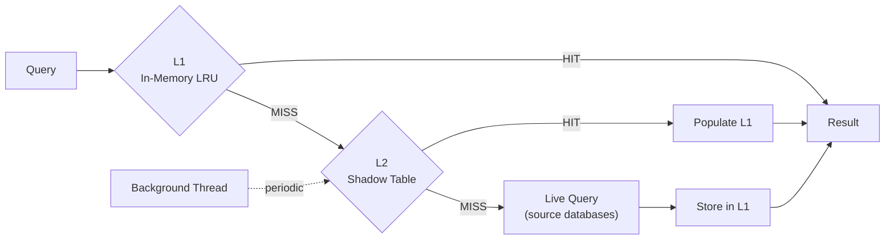
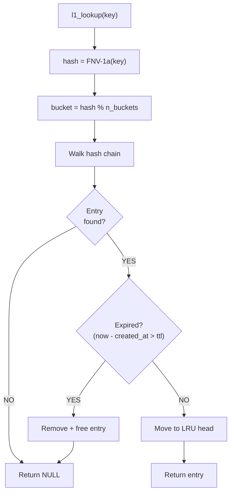
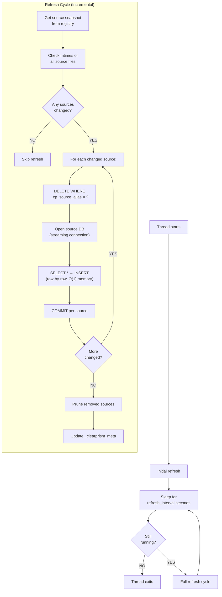

# Caching

Clearprism implements a two-tier caching system to reduce repeated queries to source databases.



## L1: In-Memory LRU Cache

The L1 cache stores query results in memory using a hash table with a doubly-linked LRU list. It is always enabled.

### Cache Key

The cache key is derived from:
- Target table name
- Source alias (if `_source_db` is constrained)
- Constraint structure (column index and operator for each constraint)
- Constraint parameter values

Format: `"table_name:src=alias:c0=col:op:c1=col:op:p0=value0:p1=value1:"`

Including the constraint structure in the key prevents collisions between queries with different operators but identical (or absent) parameter values — for example, `WHERE email IS NULL` vs `WHERE email IS NOT NULL`.

### Data Storage

Each cached entry stores deep copies of `sqlite3_value` objects via `sqlite3_value_dup()`. Rows are stored as a singly-linked list of `clearprism_l1_row` structures, each containing an array of `sqlite3_value*` pointers.

### TTL

Each L1 entry has a 60-second time-to-live. Expired entries are lazily evicted on the next lookup for the same key. You can also trigger a sweep of all expired entries via `clearprism_l1_evict_expired()`.

### Eviction Policy

L1 enforces two limits simultaneously:

| Limit | Default | Configuration |
|-------|---------|---------------|
| Max rows (total across all entries) | 10,000 | `l1_max_rows` |
| Max bytes (estimated memory usage) | 64 MiB | `l1_max_bytes` |

When an insert would exceed either limit, the least recently used entry is evicted. Eviction continues until both limits are satisfied. If a single entry exceeds both limits and the cache is empty, the insert is rejected (`SQLITE_FULL`).

### L1 Population from Live Queries

When a query misses both L1 and L2, Clearprism executes a live query against the source databases. As rows stream through, they are buffered in a linked list on the cursor. When the scan completes (all sources exhausted or LIMIT reached), the buffer is flushed into L1 so subsequent identical queries get a cache hit.

To prevent a single large result set from evicting the entire cache, each query is limited to buffering at most **25% of `l1_max_rows`**. If the result exceeds this threshold, the buffer is discarded and the result is not cached.

### Thread Safety

All L1 operations are protected by a `pthread_mutex_t`. Operations are fast (hash lookup + pointer manipulation), so contention is minimal.

### Lookup flow



## L2: Shadow Table Cache

The L2 cache materializes a copy of all source data into a local SQLite database. It is auto-enabled by default (at `/tmp/clearprism_cache_{vtab}_{table}.db`); set `cache_db='none'` to disable. The initial populate runs asynchronously in a background thread, so `CREATE VIRTUAL TABLE` returns immediately. If the background populate has finished by the time a query runs, simple queries (full scans without ORDER BY/LIMIT) serve directly from the shadow table — avoiding the slow virtual table protocol path entirely. If the populate is still in progress, queries fall through to the live path without blocking.

### Shadow Table Schema

For a federated table `users`, the shadow table is named `_clearprism_cache_users`:

```sql
CREATE TABLE _clearprism_cache_users (
    -- all columns from the source table --
    "id" INTEGER,
    "name" TEXT,
    "email" TEXT,
    -- metadata columns --
    _cp_source_alias TEXT NOT NULL,
    _cp_refreshed_at TEXT NOT NULL DEFAULT (datetime('now'))
);

CREATE INDEX idx__clearprism_cache_users_source
    ON _clearprism_cache_users(_cp_source_alias);
```

A metadata table tracks refresh state:

```sql
CREATE TABLE _clearprism_meta (
    table_name TEXT PRIMARY KEY,
    last_refresh TEXT
);
```

### Journal Mode

The L2 cache database uses DELETE journal mode. Query threads open a fresh read connection per query (closed when the cursor is freed) rather than sharing a long-lived reader connection. This avoids stale-snapshot issues that can occur with WAL mode when the writer updates the database between the reader's open and its first read. A writer connection (`writer_db`) is used exclusively by the background refresh thread.

### Background Refresh

The refresh thread runs a full refresh cycle at the configured interval (`l2_refresh_sec`, default 300 seconds):



Key details:
- **Streaming refresh**: Rows are read from each source and inserted directly into the shadow table one at a time — O(1) memory regardless of dataset size. No buffering or `sqlite3_value_dup()` overhead.
- **Incremental**: Only sources whose file mtime has changed since the last refresh are re-read. Unchanged sources are skipped entirely.
- **Per-source commits**: Each changed source is refreshed in its own transaction (DELETE old rows + INSERT new rows + COMMIT), so partial failures don't roll back other sources.
- **Non-blocking L2**: The first refresh runs in the background thread immediately after `CREATE VIRTUAL TABLE`. If the populate has already finished when a simple query (no ORDER BY/LIMIT/OFFSET) runs, it serves directly from the shadow table — avoiding the slow virtual table protocol path (~10 indirect function calls per row). If the populate is still in progress, the query falls through to the live path without blocking. Queries with ORDER BY, LIMIT, or OFFSET always use the live path for correct handling.
- The refresh thread opens its own dedicated connections to source databases (not from the shared pool) to avoid thread safety issues
- Each source is processed independently — if one source fails, the others still get refreshed
- The `running` flag is checked between each source to allow clean shutdown
- Removed sources are pruned (rows deleted from shadow table) at the end of each refresh cycle

### Freshness Check

L2 is considered "fresh" if `(now - last_refresh) < refresh_interval_sec`. When stale, L2 lookups are skipped and live queries are used instead.

### Lifecycle

| Event | Action |
|-------|--------|
| `xCreate` / `xConnect` | Create shadow table if not exists, start refresh thread |
| `xFilter` (cache miss) | Non-blocking check via `clearprism_l2_is_ready()`; if L2 populate is done, query via `clearprism_l2_query_ex()` with a fresh connection; L2 cursors serve simple scans directly, complex queries (ORDER BY/LIMIT/OFFSET) fall through to live path |
| `xDisconnect` / `xDestroy` | Set `running = 0`, join refresh thread, close both connections |

### Current Limitations

- L2 query-time lookups parse the cache key to extract a source alias for filtering; queries without a source constraint search the entire shadow table
