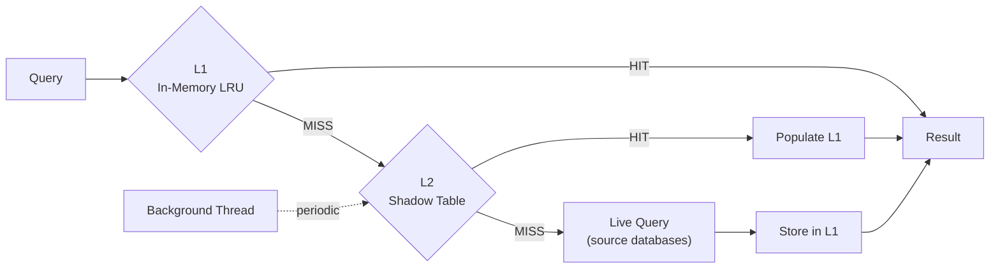
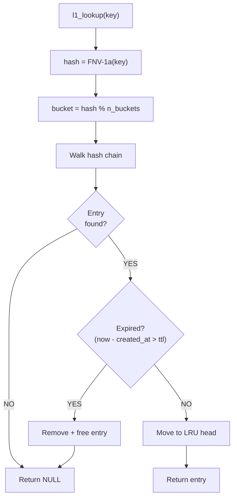
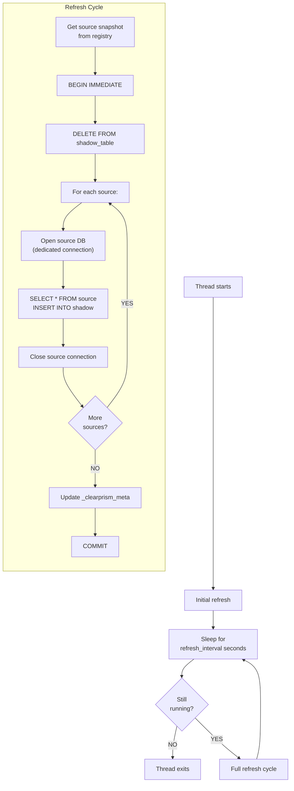

# Caching

Clearprism implements a two-tier caching system to reduce repeated queries to source databases.



## L1: In-Memory LRU Cache

The L1 cache stores query results in memory using a hash table with a doubly-linked LRU list. It is always enabled.

### Cache Key

The cache key is derived from:
- Target table name
- Source alias (if `_source_db` is constrained)
- Constraint parameter values

Format: `"table_name:src=alias:p0=value0:p1=value1:"`

### Data Storage

Each cached entry stores deep copies of `sqlite3_value` objects via `sqlite3_value_dup()`. Rows are stored as a singly-linked list of `clearprism_l1_row` structures, each containing an array of `sqlite3_value*` pointers.

### TTL

Each L1 entry has a 60-second time-to-live. Expired entries are lazily evicted on the next lookup for the same key. You can also trigger a sweep of all expired entries via `clearprism_l1_evict_expired()`.

### Eviction Policy

L1 enforces two limits simultaneously:

| Limit | Default | Configuration |
|-------|---------|---------------|
| Max rows (total across all entries) | 10,000 | `l1_max_rows` |
| Max bytes (estimated memory usage) | 64 MiB | `l1_max_bytes` |

When an insert would exceed either limit, the least recently used entry is evicted. Eviction continues until both limits are satisfied. If a single entry exceeds both limits and the cache is empty, the insert is rejected (`SQLITE_FULL`).

### Thread Safety

All L1 operations are protected by a `pthread_mutex_t`. Operations are fast (hash lookup + pointer manipulation), so contention is minimal.

### Lookup flow



## L2: Shadow Table Cache

The L2 cache materializes a copy of all source data into a local SQLite database. It is optional — only enabled when `cache_db` is specified.

### Shadow Table Schema

For a federated table `users`, the shadow table is named `_clearprism_cache_users`:

```sql
CREATE TABLE _clearprism_cache_users (
    -- all columns from the source table --
    "id" INTEGER,
    "name" TEXT,
    "email" TEXT,
    -- metadata columns --
    _cp_source_alias TEXT NOT NULL,
    _cp_refreshed_at TEXT NOT NULL DEFAULT (datetime('now'))
);

CREATE INDEX idx__clearprism_cache_users_source
    ON _clearprism_cache_users(_cp_source_alias);
```

A metadata table tracks refresh state:

```sql
CREATE TABLE _clearprism_meta (
    table_name TEXT PRIMARY KEY,
    last_refresh TEXT
);
```

### WAL Mode

The L2 cache database runs in [WAL (Write-Ahead Logging) mode](https://www.sqlite.org/wal.html). This is the critical design choice that allows the background refresh thread to write without blocking query threads from reading. Two separate connections are used:

- **Reader connection** (`reader_db`): Used by query threads to read the shadow table
- **Writer connection** (`writer_db`): Used exclusively by the background refresh thread

### Background Refresh

The refresh thread runs a full refresh cycle at the configured interval (`l2_refresh_sec`, default 300 seconds):



Key details:
- The refresh thread opens its own dedicated connections to source databases (not from the shared pool) to avoid thread safety issues
- Each source is processed independently — if one source fails, the others still get refreshed
- The `running` flag is checked between each source to allow clean shutdown
- The entire refresh is wrapped in a single transaction on the writer connection

### Freshness Check

L2 is considered "fresh" if `(now - last_refresh) < refresh_interval_sec`. When stale, L2 lookups are skipped and live queries are used instead.

### Lifecycle

| Event | Action |
|-------|--------|
| `xCreate` / `xConnect` | Create shadow table if not exists, start refresh thread |
| `xFilter` (cache miss) | L2 not currently queried for individual lookups (primarily used for full refresh) |
| `xDisconnect` / `xDestroy` | Set `running = 0`, join refresh thread, close both connections |

### Current Limitations

- L2 currently does a full DELETE + INSERT refresh, not incremental updates
- Individual query-level L2 lookups are not yet fully implemented — L2 primarily serves as a pre-warmed materialization
- The refresh thread is detached (`pthread_detach`), which means it cleans up after itself but may still be running briefly after `xDisconnect`
