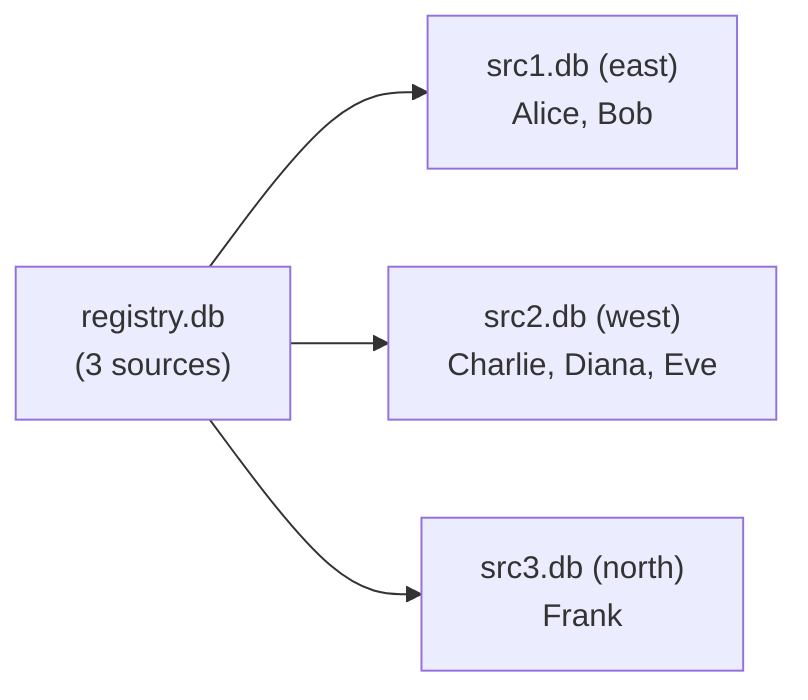

# Testing

Clearprism has a custom test framework covering each subsystem and end-to-end virtual table behavior.

## Running Tests

```bash
# Using Make
make test

# Using CMake
mkdir build && cd build
cmake ..
make test_run
```

Expected output:

```
=== Clearprism Test Suite ===

[Registry Tests]
  PASS: registry_open returns non-NULL
  PASS: registry has 3 sources
  PASS: snapshot returns OK
  PASS: snapshot has 5 sources
  PASS: first source alias is 'source_0'
  PASS: sources sorted by priority
  PASS: invalid path returns NULL
  PASS: NULL path returns NULL

[Connection Pool Tests]
  PASS: pool_create returns non-NULL
  PASS: checkout returns non-NULL
  ...

[Cache Tests]
  PASS: l1_create returns non-NULL
  PASS: l1_insert returns OK
  ...

[Virtual Table Tests]
  PASS: module registration
  PASS: CREATE VIRTUAL TABLE succeeds
  PASS: SELECT returns 6 rows total
  ...

=== Results: N/N passed ===
```

## Test Structure

All tests are in the `test/` directory:

| File | What it tests | Key scenarios |
|------|--------------|---------------|
| `test_main.c` | Test runner | Aggregates results, reports pass/fail counts |
| `test_registry.c` | Registry subsystem | Open/close, snapshot with priority ordering, invalid paths, NULL path |
| `test_connpool.c` | Connection pool | Create/destroy, checkout/checkin, connection reuse, multiple DBs, LRU eviction, invalid paths |
| `test_cache.c` | L1 + unified cache | Create/destroy, insert/lookup, LRU eviction, TTL expiry (2s sleep), unified cache facade |
| `test_vtab.c` | End-to-end virtual table | Basic SELECT across 3 sources, `_source_db` filter, WHERE pushdown (LIKE, EQ), empty results, cache_db mode, monotonic rowids |

## Test Framework

The framework is minimal — a `test_report(name, passed)` function that tracks total/passed/failed counts:

```c
void test_report(const char *name, int passed);
```

Tests call this after each assertion. The test runner returns exit code 1 if any tests failed.

## Test Database Setup

The virtual table tests (`test_vtab.c`) create temporary databases in `/tmp`:



All test databases are created fresh before each test and cleaned up afterward (including WAL/SHM files).

### Registry setup

```sql
clearprism_sources:
  east  → /tmp/clearprism_vtab_test_src1.db (priority 0)
  west  → /tmp/clearprism_vtab_test_src2.db (priority 1)
  north → /tmp/clearprism_vtab_test_src3.db (priority 2)
```

### Source data

```sql
-- east (src1)
users: (1, 'Alice', 'alice@example.com'), (2, 'Bob', 'bob@east.com')

-- west (src2)
users: (10, 'Charlie', 'charlie@example.com'), (11, 'Diana', 'diana@west.com'), (12, 'Eve', 'eve@example.com')

-- north (src3)
users: (20, 'Frank', 'frank@north.com')
```

## Test Scenarios

### Registry Tests

| Test | Validates |
|------|-----------|
| `test_registry_open_close` | Opens a registry with 3 sources, verifies count |
| `test_registry_snapshot` | Gets a snapshot of 5 sources, verifies priority ordering |
| `test_registry_invalid_path` | Non-existent registry file returns NULL |
| `test_registry_null_path` | NULL path returns NULL |

### Connection Pool Tests

| Test | Validates |
|------|-----------|
| `test_pool_create_destroy` | Pool creation and cleanup |
| `test_pool_checkout_checkin` | Open a DB, verify it's usable, checkin, re-checkout (reuse) |
| `test_pool_multiple_dbs` | 3 distinct databases get distinct connections |
| `test_pool_eviction` | Pool with max_open=2 evicts LRU when 3rd DB is requested |
| `test_pool_invalid_path` | Non-existent DB path returns NULL |

### Cache Tests

| Test | Validates |
|------|-----------|
| `test_l1_create_destroy` | L1 creation and cleanup |
| `test_l1_insert_lookup` | Insert a row, look it up, verify miss for unknown key |
| `test_l1_eviction` | Cache with max_rows=2 evicts LRU on third insert |
| `test_l1_ttl_expiry` | Entry with 1s TTL expires after 2s sleep |
| `test_unified_cache` | Cache facade returns miss/hit correctly, cursor works |

### Virtual Table Tests

| Test | Validates |
|------|-----------|
| `test_vtab_basic_select` | SELECT across 3 sources returns 6 rows with correct `_source_db` |
| `test_vtab_source_filter` | `WHERE _source_db = 'west'` returns only 3 rows |
| `test_vtab_where_pushdown` | `WHERE email LIKE '%@example.com'` returns 3 rows; `WHERE name = 'Bob'` returns 1 |
| `test_vtab_empty_result` | Non-existent `_source_db` value returns 0 rows |
| `test_vtab_with_cache` | Virtual table with `cache_db` option returns correct results |
| `test_vtab_rowid` | Rowids are monotonically increasing across all sources |

## Writing New Tests

1. Add test functions to the appropriate `test_*.c` file (or create a new one)
2. Call `test_report("description", condition)` for each assertion
3. If creating a new file, add a `test_*_run()` function and call it from `test_main.c`
4. Add the new file to both `CMakeLists.txt` (`TEST_SOURCES`) and `Makefile` (`TEST_SRCS`)

```c
static void test_my_feature(void)
{
    /* Setup */
    int result = do_something();
    test_report("my feature works", result == EXPECTED);

    /* Cleanup */
}

int test_mymodule_run(void)
{
    test_my_feature();
    return 0;
}
```
